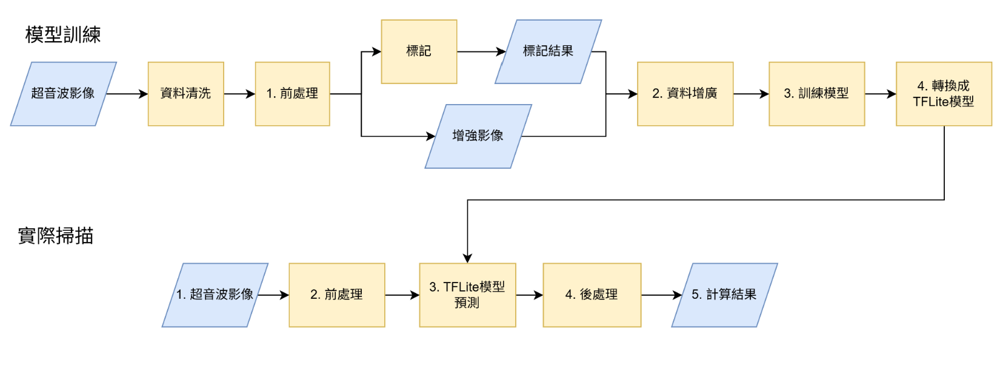

# 自動化都普勒血管取樣框定位系統 An Automated System for Doppler Ultrasound Vascular Sampling Frame Localization

Demo video：<https://drive.google.com/file/d/1T_JKMZ3sjOHdsewaSxW32veMggLWTDnQ/view>

## 1. 系統總覽

本專案分成三個部分，對應下圖「模型訓練」與「實際掃描」兩階段：

| 目錄 | 角色 | 對應下圖步驟 |
|---|---|---|
| [`python/train/`](python/train) | **離線模型訓練**：資料前處理、標記、增廣、訓練分割模型、轉換成 TFLite | 模型訓練 1~4 |
| [`cpp/`](cpp) | **前/後處理邏輯的 C++ 驗證版**：用既有標記（ground-truth mask）直接跑前處理與後處理量測，不含模型推論，用於在部署到 Android 之前，用原生 C++ 驗證/校準前處理與量測邏輯的正確性 | 對應「實際掃描」的 2. 前處理 / 4. 後處理 |
| [`android/`](android) | **端側部署**：載入訓練好的 `.tflite` 模型，在裝置上即時對超音波影格做前處理 → 模型推論 → 後處理量測 | 實際掃描 1~5（完整流程） |

`python/train/` 訓練出的模型會轉換成 `.tflite`，放進
[`android/app/src/main/assets/ESRGAN.tflite`](android/app/src/main/assets/ESRGAN.tflite)（沿用 TensorFlow Lite 官方範例的檔名，實際是血管分割模型）給 Android 端載入使用。



## 2. 模型訓練（`python/train/`）

| 檔案 | 對應步驟 | 說明 |
|---|---|---|
| [`pre.py`](python/train/pre.py) | 1. 前處理 | `apply_clahe`：CLAHE 對比強化；`remove_green_red`：用 HSV 色域偵測並 inpaint 掉超音波機介面上的紅/綠色 UI 疊圖（都卜勒血流色標、量測游標等）；`resize_with_padding`：等比縮放並補邊到 224×224；`detected_line`：偵測畫面上的都卜勒取樣線（綠色直線），算出角度與位置，作為後續判斷血流方向的基準線 |
| （標記／增強影像） | 標記、增強影像 | 人工標記血管內腔 mask（`*_label.png`），並視需要做資料增強，兩者合併後供訓練使用 |
| [`train_small.py`](python/train/train_small.py) | 2~4. 資料增廣／訓練模型／轉換 TFLite | 以 `MobileNetV3Small`（ImageNet 預訓練權重）為 encoder 的 U-Net 分割模型，input 224×224×1 灰階影像，輸出血管內腔二值遮罩 |
| [`train_large.py`](python/train/train_large.py) | 同上 | 以 `MobileNetV3Large` 為 encoder 的加大版 U-Net，可選擇加上 attention gate（`use_attention`），訓練時使用 `combined_loss`（0.3 × binary cross-entropy + 0.7 × Dice loss）並以 Dice/IoU 作為評估指標；`__main__` 區塊會呼叫 `pre_processor`/`post_processor` 跑完整「前處理 → 模型推論 → 後處理」流程並輸出每張影像的 Dice 分數統計 |
| [`post.py`](python/train/post.py) | 4. 後處理／5. 計算結果 | `process_single_centerline`：對分割遮罩做連通域分析＋medial-axis 骨架化＋距離轉換找出血管半徑，再用 spline 擬合出平滑中心線；`get_tangent_direction`：用 **PCA** 取得中心線上任一點的切線方向（即血流方向）；`get_boundary_intersection_direct`／`draw_perpendicular_line`／`find_RangeGate`：依切線方向算出垂直於血管的取樣線，決定都卜勒取樣閘門（Range Gate）該放的位置與角度；`post_process`：整合以上步驟，輸出疊加取樣框/角度標示的結果影像 |
| [`requirements.txt`](python/train/requirements.txt) | — | Python 依賴：TensorFlow/Keras 2.16、OpenCV、scikit-image、scipy、skan（骨架分析）等 |


## 3. C++ 驗證版（`cpp/`）

[`main.cpp`](cpp/main.cpp) 讀取既有的原圖與人工標記遮罩（`test_data/test_masks`，直接取代模型輸出），依序呼叫
[`pre.cpp`](cpp/pre.cpp)（對應 `pre.py` 的都卜勒取樣線偵測）與 [`post.cpp`](cpp/post.cpp)（對應 `post.py` 的中心線擷取、PCA 切線方向、垂直取樣框計算），
用來在不牽涉 TFLite 模型的情況下，以原生 C++ 驗證前/後處理邏輯與 Android 端 native pipeline 的實作是否一致，可視為
[`android/app/src/main/cc/SuperResolution.cpp`](android/app/src/main/cc/SuperResolution.cpp) 的前身/桌面對照組。

## 4. Android 端部署（`android/`）

進入點是 [`MainActivity.java`](android/app/src/main/java/org/tensorflow/lite/examples/superresolution/MainActivity.java)：載入
`ESRGAN.tflite` 模型（透過 [`AssetsUtil`](android/app/src/main/java/org/tensorflow/lite/examples/superresolution/AssetsUtil.java)）、
把選定影像的像素陣列透過 JNI（[`SuperResolution_jni.cpp`](android/app/src/main/cc/SuperResolution_jni.cpp)）丟進 native 端的
[`SuperResolution` C++ 類別](android/app/src/main/cc/SuperResolution.cpp) 執行整條 pipeline，並把結果畫回畫面。

「2. 前處理」「3. TFLite 模型預測」「4. 後處理」「5. 計算結果」四步對應到
[`SuperResolution.cpp`](android/app/src/main/cc/SuperResolution.cpp) 裡的 `DoSuperResolution()`、`doseg()`、`postprocess()`。

### 關鍵常數（[`SuperResolution.h`](android/app/src/main/cc/SuperResolution.h)）

| 常數 | 意義 |
|---|---|
| `inputHeight/Width` (886x720) | 原始輸入影格解析度 |
| `initCropX0/X1/Y0/Y1` | 粗裁切 ROI 邊界 |
| `modelinputHeight/Width/Channels` (128x512x2) | 送進 TFLite 模型的輸入張量大小（Sobel + Prewitt 兩張特徵圖） |
| `modeloutputHeight/Width/Channel` (128x512x1) | 模型輸出的分割遮罩大小 |
| `outputthreshold` (5) | 分割輸出轉二值圖的閾值 |

### 各函式對應

| 階段 | 函式 |
|---|---|
| 前處理：格式轉換 | `mat2int` / `int2mat` / `oneDtotwoD` / `twoDtooneD` |
| 前處理：ROI 裁切 | `InitCrop` |
| 血管軸/壁定位 | `get_cropImg_axis`（先用 `smooth` 做多層移動平均，再抓局部極大值推測血管壁位置） |
| 去噪 | `eliNoise`、`imgsToPrewitt` |
| TFLite 模型推論 | `doseg`（Sobel + Prewitt 特徵 → resize → 餵進 `TfLiteInterpreter` → threshold） |
| 結果貼回 | `pasteBack` |
| 後處理／量測 | `postprocess`（輪廓偵測、IMT 與 LD/IAD 比值計算、文字疊圖） |
| 整合入口 | `DoSuperResolution`（JNI 呼叫的主函式） |

### 檔案地圖（`android/`，清理後僅保留建置與執行必需項目）

```
android/
├── README.md                ← 原始建置說明（TFLite 範例遺留，步驟仍可用）
├── .gitignore                ← 忽略 build/IDE 快取與可重新下載的 aar
├── build.gradle / settings.gradle / gradle.properties / gradlew(.bat) / gradle/
│                             ← Gradle 專案骨架
├── app/
│   ├── build.gradle          ← App 模組設定；CMake 參數 -DOpenCV_DIR 指到 opencv/native
│   ├── download.gradle       ← 建置前自動下載 ESRGAN.tflite 與 TFLite aar
│   ├── proguard-rules.pro
│   └── src/main/
│       ├── AndroidManifest.xml
│       ├── assets/           ← ESRGAN.tflite（模型）+ old.jpg/young.jpg/liang.jpg（Demo 用測試影格）
│       ├── cc/                ← ★ Pipeline 核心 native 程式碼
│       │   ├── CMakeLists.txt
│       │   ├── SuperResolution.h / .cpp   ← pipeline 邏輯（見上）
│       │   └── SuperResolution_jni.cpp    ← JNI 橋接
│       ├── java/.../superresolution/
│       │   ├── MainActivity.java   ← App 進入點、模型載入、UI 綁定
│       │   └── AssetsUtil.java     ← Asset 檔案讀取工具
│       ├── jniLibs/<ABI>/libopencv_java4.so  ← OpenCV 動態庫（Gradle 直接打包用）
│       └── res/               ← Demo UI layout / 字串 / 圖示
├── libraries/                 ← TFLite C API 標頭與 .so（4 個 ABI，download.gradle 可重新產生）
└── opencv/                    ← OpenCV Android SDK（已精簡，見下）
    ├── build.gradle           ← Gradle library module，負責把 libopencv_java4.so 打包進 APK
    ├── java/{src,res,AndroidManifest.xml}  ← OpenCV Java wrapper（本專案未在 Java 端呼叫，僅作打包用）
    ├── libcxx_helper/         ← dummy native target，用來帶入 libc++_shared.so
    ├── native/jni/include/    ← OpenCV C++ 標頭（cc/ 的 native pipeline 需要）
    ├── native/libs/<ABI>/libopencv_java4.so  ← OpenCV 動態庫（CMake 直接連結這份）
    └── etc/licenses/          ← 第三方授權文字（合規保留）
```

### 建置與執行

1. 需要 Android Studio、Android SDK/NDK（`ndkVersion 26.3.11579264`）。
2. 在 `android/` 目錄執行 `./gradlew fetchTFLiteLibs`（Windows 用 `gradlew.bat`）：會自動下載 `ESRGAN.tflite` 模型與 TFLite C API 的 headers/`.so`（若 `libraries/`、`assets/ESRGAN.tflite` 已存在則略過）。
3. 用 Android Studio 開啟 `android/` 資料夾，等待 Gradle sync + CMake 設定完成。
4. 連接裝置或啟動模擬器，執行 `app`；也可在 UI 切換 CPU/GPU（`GPU` 開關對應 `TfLiteGpuDelegateV2`）執行推論。
